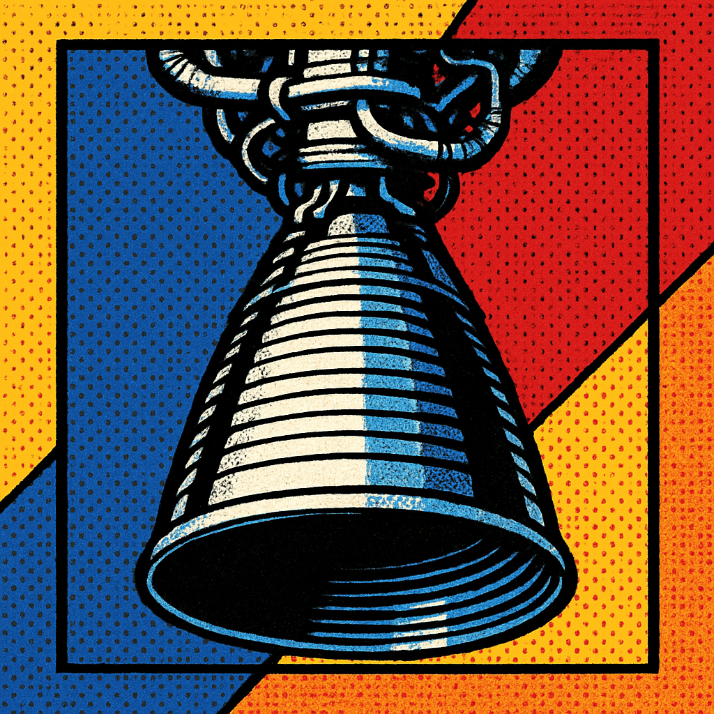
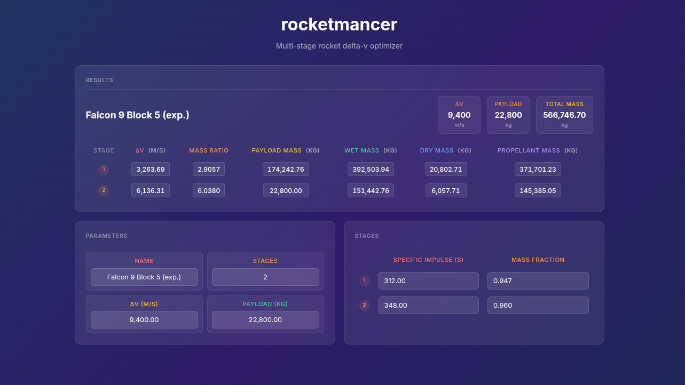

<div align="center">



# rocketmancer


*A multi-stage rocket delta-v optimizer.*

[**Live Demo**](https://rocketmancer.thaumics.org)



</div>

## Background

rocketmancer is a multi-stage rocket delta-v optimizer based on the [original rocketmancer](https://github.com/BruhLemma-Yadecha/rocketmancer) and its predecessor, [multistage](https://github.com/BruhLemma-Yadecha/multistage). It takes trip and vehicle parameters and finds the delta-v split across stages that minimizes total vehicle mass.

The primary goal was to fix the usability issues of those legacy projects by providing a proper web interface. The solver itself was also reworked: rather than using a general-purpose constrained optimizer, the problem is solved analytically via Lagrange multipliers, reducing the full optimization to a simple bisection on a single scalar.

## How It Works

The backbone is the [Tsiolkovsky Rocket Equation](https://en.wikipedia.org/wiki/Tsiolkovsky_rocket_equation). For a multi-stage rocket, total mass is a product of per-stage mass amplification factors, each depending only on that stage's delta-v allocation. Taking the log decomposes the objective into a sum of independent terms, and the Lagrange optimality condition gives a closed-form expression for each stage's mass ratio given a multiplier λ. Bisecting on λ until the delta-v allocations sum to the target solves the problem exactly.

When a minimum stage contribution is set, the solver uses an active-set method: stages that fall below the floor are pinned to the minimum, and the remaining delta-v is re-optimized across unpinned stages. Dual variable checks ensure pinned stages are released if they become cost-effective, guaranteeing the constrained optimum.

## Quick Start

```bash
git clone https://github.com/BruhLemma-Yadecha/rocketmancer.git
cd rocketmancer
npm install
npm run dev
```

## License

[MIT](LICENSE)
